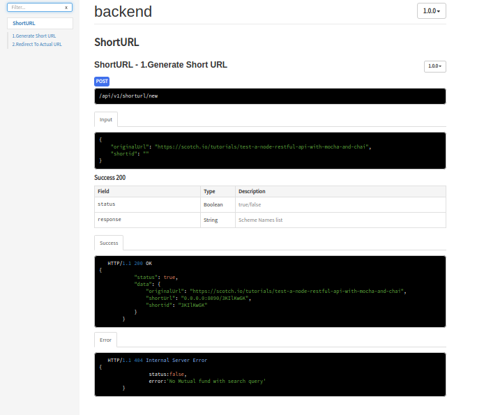

# URL_Shortner :- 
<h1 align="center">Creating custom URL shortener With MERN Stack</h1>

## Features:-
-  Shorten given long URL
-  Redirect to original on accessing short URL
-  URL Expiry(Removing From DB after some time)
-  URL analytics(Storing Count and Last Opened Date)
-  Custom short URLs
    - Acutual URL:https://github.com/chandrashekar3792/pdf (it is my PDF Parsers Package, SO i can shortly name it as pdfparser)
    - Custom Path: pdfparser
    - ShortURL: https://domain_name.com/pdfparser
- Rate Limit(Rejecting API Request if more than limit from single IP Address)
## Technologies

- ### Back end

  - [AWS Lambda](https://expressjs.com/)- REST API using AWS Lambda functions in NodeJS
  - [Mongodb](http://mongodb.com/)- Document oriented NoSQL database
  - [Mongoose](https://http://mongoosejs.com)- MongoDB object modeling tool
  - [Short-id](https://github.com/dylang/shortid)- Short id generator
  - [Valid-url](https://github.com/ogt/valid-url)- URI validation functions
  - [Redis](https://www.redis.com)- For Storing Rate Limit for Single IP.

- ### Front end

  - [React](https://reactjs.org/) - JavaScript library for building user interfaces.
  - [React-router](https://github.com/ReactTraining/react-router)- Complete routing library for React
  - [reactstrap](https://reactstrap.github.io/components/)- Responsive front-end framework based on Bootstrap 
 
## API Documentation:-
 To Generate API Documentation
 ```
    npm install apidoc -g
    apidoc -i API/ -o apidoc
```
 
 
 
## API Testing:-
 To Run API Test Cases
 ```
    npm test
```
 
 
## START  Frontend and Backend
```
docker-compose up --build 
```
- Enter http://0.0.0.0:3000 in Browser To See URL Shortner App


